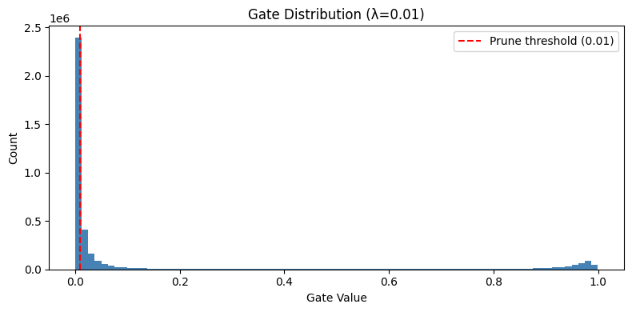
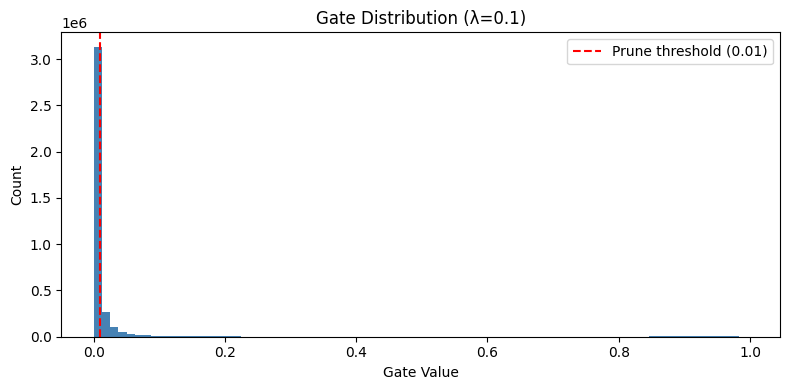
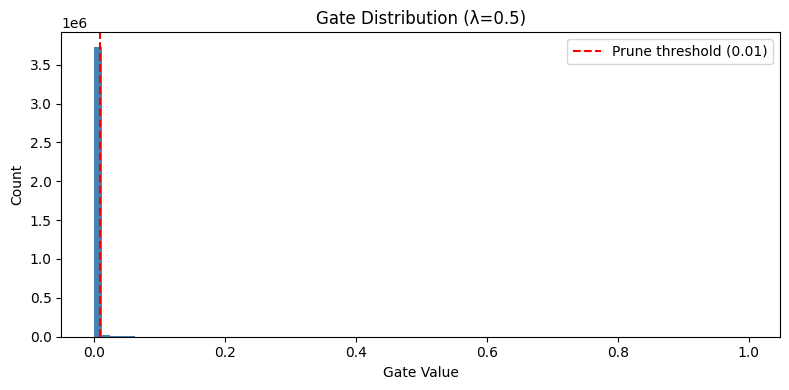

# Self-Pruning Neural Network on CIFAR-10

A neural network that **learns to prune itself during training** using learnable gate parameters — no post-training pruning required.

Built for the Tredence AI Engineering internship case study

---

## What This Does

Standard pruning removes weights *after* training. This project does something more interesting — each weight has a learnable **gate scalar** (via sigmoid) that the network learns to push toward zero *during* training, driven by an L1 sparsity penalty in the loss function.

```
Total Loss = CrossEntropyLoss + λ × SparsityLoss
SparsityLoss = mean of all gate values (L1 norm of sigmoid outputs)
```

When a gate → 0, its corresponding weight is effectively removed. No manual pruning step needed.

---

## Results

| Lambda (λ) | Test Accuracy | Sparsity | Active Weights |
|:----------:|:-------------:|:--------:|:--------------:|
| 0.01       | 56.59%        | 58.25%   | ~1.59M / 3.8M  |
| 0.10       | 56.22%        | 92.00%   | ~304K / 3.8M   |
| 0.50       | 54.64%        | 97.72%   | ~87K / 3.8M    |

**Key finding:** Accuracy stays within ~2% across a 50× range of λ, while sparsity goes from 58% → 98%. The network has massive redundancy — most connections can be removed with negligible performance cost.

### Gate Distributions

| λ = 0.01 | λ = 0.1 | λ = 0.5 |
|----------|---------|---------|
|  |  |  |

All three show a dominant spike at gate ≈ 0 (pruned weights) and a small surviving cluster (critical connections) — the expected bimodal distribution confirming the mechanism works.

---

## Project Structure

```
self-pruning-nn/
├── notebooks/
│   └── main.ipynb          # Full experiment notebook (recommended entry point)
├── src/
│   ├── model.py            # PrunableLinear layer + PrunableNet architecture
│   ├── train.py            # Training loop, evaluation, sparsity calculation
│   └── utils.py            # Gate distribution plotting, optimizer factory
├── plots/
│   ├── gate_dist_lambda_0.01.png
│   ├── gate_dist_lambda_0.1.png
│   └── gate_dist_lambda_0.5.png
├── report.md               # Full write-up with analysis
├── requirements.txt
└── README.md
```

---

## Quickstart

### 1. Clone and install

```bash
git clone https://github.com/siddhivdash/Self-Pruning-Neural-Networks.git
cd Self-Pruning-Neural-Networks
pip install -r requirements.txt
```

### 2. Run the notebook (recommended)

```bash
cd notebooks
jupyter notebook main.ipynb
```

Run all cells top to bottom. CIFAR-10 downloads automatically (~170MB) on first run.

### 3. Run as a script (optional)

The notebook is the primary deliverable per the case study spec, but the `src/` modules are importable if you want to experiment:

```python
from src.model import PrunableNet
from src.train import run_pipeline

acc, sparsity = run_pipeline(lambda_sparse_val=0.1)
```

---

## How It Works

### PrunableLinear Layer

```python
class PrunableLinear(nn.Module):
    def __init__(self, in_features, out_features):
        # Standard weight + bias
        self.weight = nn.Parameter(...)       # shape: (out, in)
        self.bias   = nn.Parameter(...)

        # One learnable gate score per weight
        self.gate_scores = nn.Parameter(torch.zeros(out_features, in_features))

    def forward(self, x):
        gates         = torch.sigmoid(self.gate_scores)   # ∈ (0, 1)
        pruned_weight = self.weight * gates               # element-wise mask
        return F.linear(x, pruned_weight, self.bias)
```

Gradients flow through both `weight` and `gate_scores` — the optimizer updates both simultaneously.

### Why L1 for Sparsity?

The L1 gradient w.r.t. gate_score is `sigmoid'(score) = gate × (1 − gate)`, always positive — it **always pushes gate_scores down** regardless of their current value. L2 would produce `2 × gate × (1 − gate)`, which shrinks near zero and stalls before pruning completes. L1 drives gates to **exactly zero**, not just small values.

### Two-Stage Training

| Stage | Epochs | λ | Purpose |
|-------|--------|----|---------|
| Warm-up | 8 | 0.0 | Build accuracy before pruning pressure |
| Pruning | 12 | λ > 0 | Gates pushed toward 0 by sparsity loss |

Gate parameters use a **10–100× higher learning rate** than weights during pruning. This is necessary because the sparsity gradient is much smaller than the classification gradient flowing through the same parameters.

---

## Hardware

Tested on CPU (Intel). Each full pipeline run (8 warm-up + 12 pruning epochs) takes approximately **35–40 minutes on CPU**. GPU will be ~5–8× faster.

---

## Requirements

```
torch>=2.0.0
torchvision>=0.15.0
numpy
matplotlib
tqdm
```

---

